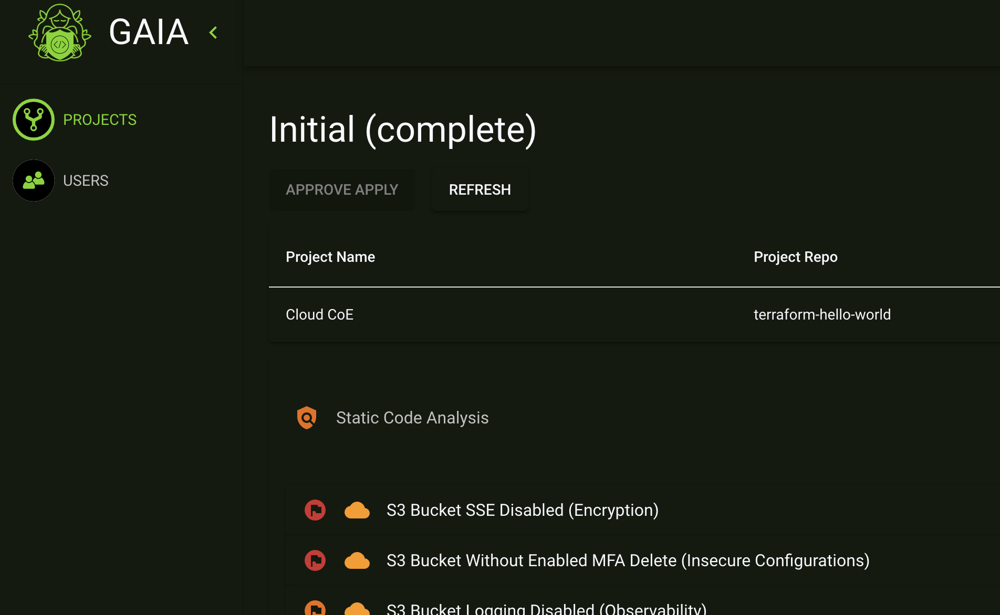

# Add a Job

Navigate to a project within the **Projects** page. 

In the project's page, Click on **Add Job**

Fill in the form

- **Job Name** can be any string that describes the reason for applying the terraform

Click on **Add Job**

Once a job has been added, GAIA will begin working on the repo. The following is a breakdown of the datapoints being collected. 

- linting ([tflint](https://github.com/terraform-linters/tflint))
 
- static code analysis ([kics](https://github.com/Checkmarx/kics)). 

- capture terraform plan

- create graph data in [drawio format](https://drawio-app.com/import-from-csv-to-drawio/)

These datapoints are presented back to the end user within the job's page.

After reviewing the content, selecting **Approve Apply** will initiate GAIA to run terraform apply against the current plan. Terraform output will be appended to the datapoints in the job's page. 

