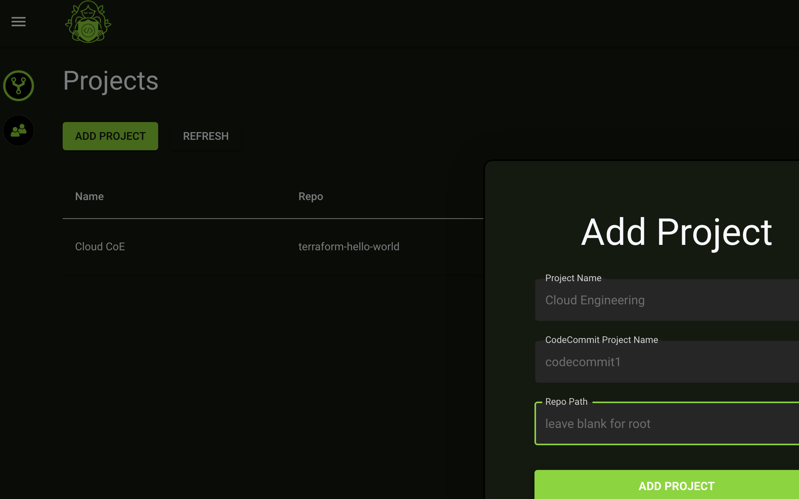

# Add a Project

Navigate to the **Projects** page. 

Click on **Add Project**

Fill in the form

- **Project Name** can be any string that describes the project
- **CodeCommit Project Name** should be the actual repo name of your codecommit
- **Repo Path** the path within the repo where your main.tf file exists. **Do not use a "/" at the beginning of this path**

Click on **Add Project**

